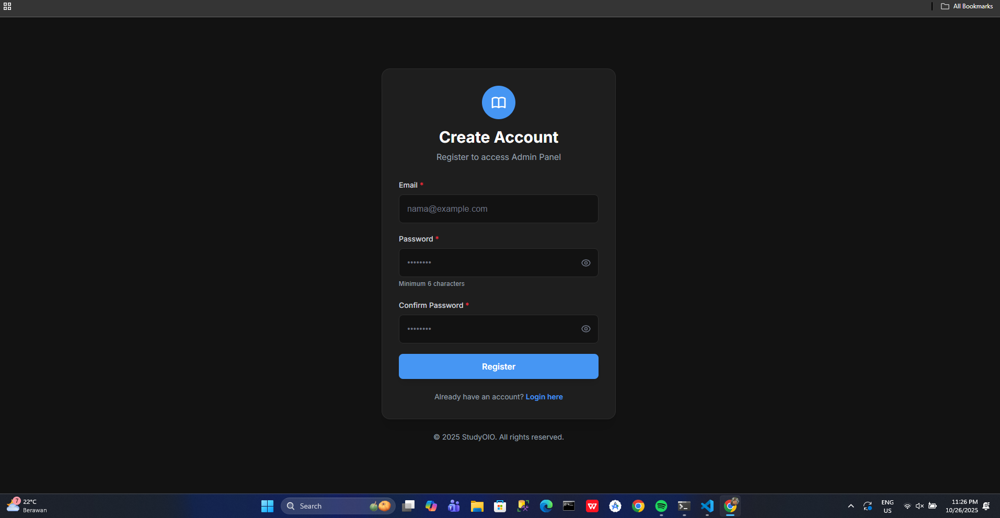
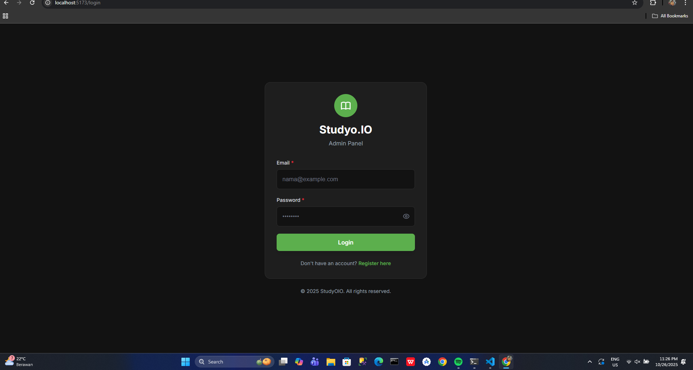
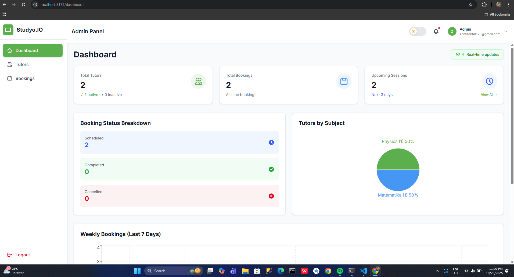
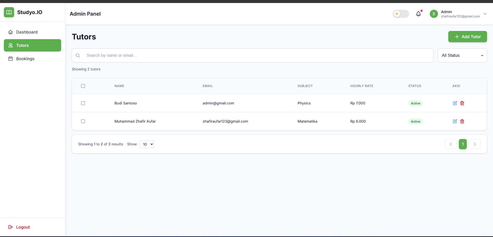
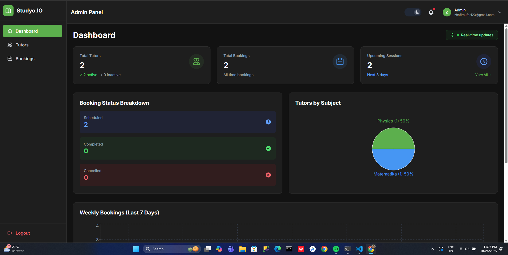
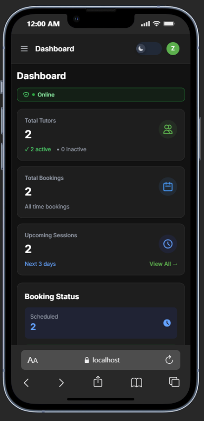

# 📚 StudyOIO — Admin Dashboard

> A modern, responsive admin panel for managing tutors and bookings in a private tutoring platform, built with React, TypeScript, and Firebase.

---

## 📋 Overview

This project was developed as a **web developer internship assignment** to demonstrate proficiency in React, TypeScript, state management, and Firebase integration. The dashboard enables administrators to manage **tutors**, **bookings**, and view **real-time analytics** through an intuitive interface.

**Core Modules:**
- 🧑‍🏫 **Tutors Management** — Create, update, delete, and filter tutors
- 📅 **Bookings Management** — Schedule, track, and manage student sessions
- 📊 **Dashboard Analytics** — View statistics, charts, and upcoming sessions

---

## 📸 Screenshots

### Register


### Login


### Dashboard


### Tutors Management


### Bookings Management


### Dark Mode


### Mobile Responsive


---

## ✨ Features

- 🔐 **Firebase Authentication** — Secure login/register with email & password
- 🗂️ **Full CRUD Operations** — Manage tutors and bookings with real-time Firestore sync
- 📈 **Interactive Dashboard** — Charts (weekly bookings, tutors by subject) using Recharts
- 🎨 **Dark Mode Support** — Toggle between light and dark themes
- 🔍 **Search & Filters** — Filter by status, search by name/email, pagination support
- 🚀 **URL State Persistence** — Pagination and filters stored in URL query params
- ⚡ **Optimized Performance** — Zustand for state management, Firebase onSnapshot for real-time updates
- 📴 **Offline Support** — Firebase IndexedDB persistence for offline data access
- 🌐 **Network Status Indicator** — Real-time online/offline detection with visual feedback
- 🎯 **Bulk Operations** — Select multiple items for batch delete operations

---

## 🛠️ Tech Stack

| Category               | Tools                                      |
|------------------------|--------------------------------------------|
| **Frontend**           | React 19.1.1 + TypeScript 5.9.3           |
| **Build Tool**         | Vite 7.1.7                                |
| **Styling**            | TailwindCSS 4.1.15                        |
| **State Management**   | Zustand 5.0.8 + Context API               |
| **Backend**            | Firebase 12.4.0 (Auth + Firestore)        |
| **Routing**            | React Router 7.9.4                        |
| **UI Components**      | Material UI (Date/Time Pickers)           |
| **Charts**             | Recharts 3.3.0                            |
| **Date Handling**      | Day.js 1.11.18                            |

---

## 📦 Dependencies

### Core Dependencies
```json
{
  "react": "^19.1.1",                    // UI library
  "react-dom": "^19.1.1",                // React DOM renderer
  "react-router-dom": "^7.9.4",          // Routing & navigation
  "typescript": "~5.9.3"                 // Type safety
}
```

### State Management & Data
```json
{
  "zustand": "^5.0.8",                   // Lightweight state management
  "firebase": "^12.4.0"                  // Backend (Auth + Firestore with offline persistence)
}
```

### UI & Styling
```json
{
  "tailwindcss": "^4.1.15",              // Utility-first CSS framework
  "@tailwindcss/vite": "^4.1.15",        // Tailwind Vite plugin
  "@mui/x-date-pickers": "^8.15.0",      // Material UI Date/Time pickers
  "@mui/material": "^6.3.2",             // Material UI components
  "@emotion/react": "^11.14.0",          // CSS-in-JS (MUI dependency)
  "@emotion/styled": "^11.14.1"          // Styled components (MUI dependency)
}
```

### Charts & Utilities
```json
{
  "recharts": "^3.3.0",                  // Dashboard charts
  "dayjs": "^1.11.18"                    // Date/time manipulation
}
```

### Build Tools
```json
{
  "vite": "^7.1.7",                      // Build tool & dev server
  "@vitejs/plugin-react": "^5.0.4",      // React plugin for Vite
  "eslint": "^9.36.0",                   // Code linting
  "typescript-eslint": "^8.45.0"         // TypeScript ESLint support
}
```

---

## �📁 Project Structure

```
src/
├── core/
│   ├── layouts/
│   │   └── DashboardLayout.tsx        # Main layout with sidebar
│   └── routes/
│       ├── AppRoutes.tsx              # Route configuration
│       ├── ProtectedRoute.tsx         # Auth guard
│       ├── PublicRoute.tsx            # Guest routes
│       └── RootRedirect.tsx           # Root redirect logic
│
├── features/
│   ├── auth/
│   │   ├── pages/                     # Login, Register
│   │   ├── hooks/                     # useAuth
│   │   ├── services/                  # authService (Firebase)
│   │   └── components/                # PasswordInput, ErrorAlert
│   │
│   ├── dashboard/
│   │   ├── pages/                     # DashboardPage
│   │   ├── components/                # StatCards, Charts
│   │   ├── hooks/                     # useDashboard
│   │   └── services/                  # dashboardService
│   │
│   ├── tutors/
│   │   ├── pages/                     # TutorsPage
│   │   ├── components/                # TutorForm, TutorsTable
│   │   ├── store/                     # tutorStore (Zustand)
│   │   ├── services/                  # tutorService (Firestore)
│   │   └── types/                     # Tutor types
│   │
│   └── bookings/
│       ├── pages/                     # BookingsPage
│       ├── components/                # BookingForm, BookingsTable
│       ├── store/                     # bookingStore (Zustand)
│       ├── services/                  # bookingService (Firestore)
│       └── types/                     # Booking types
│
├── shared/
│   ├── components/                    # Table, Modal, Sidebar, AppBar, etc.
│   ├── hooks/                         # usePagination, useFirebaseSync, useNetworkStatus
│   ├── services/
│   │   └── firebase.ts                # Firebase config
│   ├── stores/
│   │   ├── userContext.tsx            # User auth state
│   │   └── themeContext.tsx           # Dark mode state
│   └── utils/
│       └── localStorage.ts            # LocalStorage helpers
│
├── App.tsx
└── main.tsx
```

---

## ⚙️ Setup Instructions

### 1. Clone the Repository
```bash
git clone https://github.com/gitaufar/studyoio_assignment.git
cd studyoio_assignment
```

### 2. Install Dependencies
```bash
npm install
```

### 3. Configure Firebase

#### Create Firebase Project
1. Go to [Firebase Console](https://console.firebase.google.com/)
2. Create a new project
3. Enable **Authentication** (Email/Password + Google Sign-In)
4. Create **Firestore Database** (Start in production mode)
5. Add security rules:

```javascript
rules_version = '2';
service cloud.firestore {
  match /databases/{database}/documents {
    // Only authenticated users can read/write
    match /{document=**} {
      allow read, write: if request.auth != null;
    }
  }
}
```

#### Configure Environment Variables
Create a `.env` file in the root directory:

```env
VITE_FIREBASE_API_KEY=your_api_key_here
VITE_FIREBASE_AUTH_DOMAIN=your_project.firebaseapp.com
VITE_FIREBASE_PROJECT_ID=your_project_id
VITE_FIREBASE_STORAGE_BUCKET=your_project.appspot.com
VITE_FIREBASE_MESSAGING_SENDER_ID=your_sender_id
VITE_FIREBASE_APP_ID=your_app_id
```

> ⚠️ **Important**: Add `.env` to `.gitignore` to keep credentials secure

### 4. Run Development Server
```bash
npm run dev
```
Access the app at **http://localhost:5173**

### 5. Build for Production
```bash
npm run build
npm run preview
```
---

## 🎬 Demo

**Video Walkthrough**: [Watch Demo Video](https://your-demo-link-here) 

---

## 👤 Author

**Zhafir Aufar**  
📧 zhafiraufar123@gmail.com  
🔗 [GitHub @gitaufar](https://github.com/gitaufar)

---

> *Clean UI, modular code, and real-time data — simplicity with clarity.*
